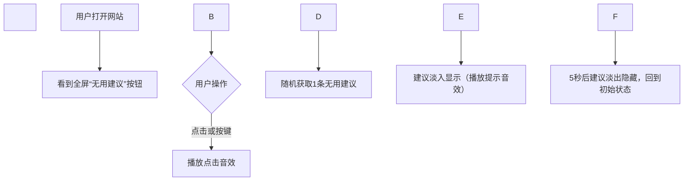

\# “无用建议按钮”网站立项报告

\## 一、项目基本信息

| 项目名称   | 极简主义“无用建议”解压网站                |

| ---------- | ----------------------------------------- |

| 项目负责人 | \[梁瑛芝]                                  |

| 学号       | \[24030601]                                |

| 项目周期   | \[2025年10月2日 ]                          |

| 技术栈     | 前端（HTML/CSS/JavaScript）、Tailwind CSS |

\## 二、项目背景与意义

\### 1. 背景

当下用户面临工作、学习压力，常因“寻求建议却得到无效答案”产生共鸣；同时，“极简主义”“解压类轻应用”成为用户需求热点，无需复杂操作、能快速带来情绪价值的产品更易被接受。

\### 2. 项目意义

\- \*\*用户价值\*\*：通过“反差感”幽默内容（无用建议）缓解用户焦虑，提供即时解压体验，操作零门槛，适配全年龄段用户。

\- \*\*技术价值\*\*：实践前端基础技术（DOM操作、动画效果、音效控制），掌握响应式设计与用户交互优化，为后续复杂项目积累经验。

\## 三、项目目标

1\. 核心功能：实现“点击按钮→随机显示无用建议+播放音效”的完整交互，确保功能稳定（兼容Chrome、Safari、Edge等主流浏览器）。

2\. 界面设计：遵循极简风格，以“全屏按钮”为核心，搭配平滑动画（按钮脉冲、建议淡入淡出），适配手机、平板、桌面端。

3\. 扩展准备：预留“用户投稿建议”功能接口，为后续内容库扩容做铺垫。

\## 四、核心功能设计

\### 1. 功能模块拆分

| 模块名称       | 功能描述                                  | 技术实现要点                          |

|----------------|-------------------------------------------|---------------------------------------|

| 交互按钮模块   | 全屏可点击按钮，带hover效果、脉冲动画；支持键盘触发（空格/回车） | CSS动画（@keyframes pulse）、JS键盘事件监听 |

| 建议生成模块   | 点击按钮后，从预设数组中随机抽取1条建议并显示 | JS数组存储建议、Math.random()随机取值 |

| 音效控制模块   | 点击时播放“按钮音效”，建议显示时播放“提示音效” | HTML5 Audio标签、currentTime重置播放 |

| 响应式适配模块 | 按钮大小、建议文本字体随屏幕尺寸自动调整 | Tailwind CSS clamp()函数、媒体查询    |

\### 2. 核心流程

